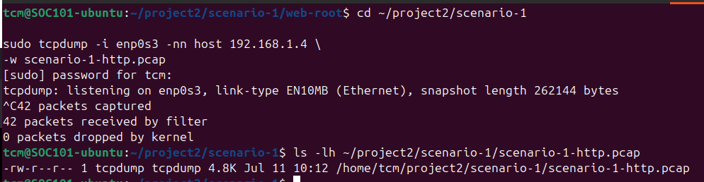
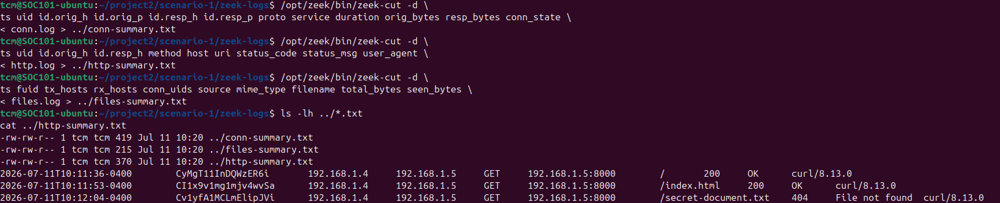
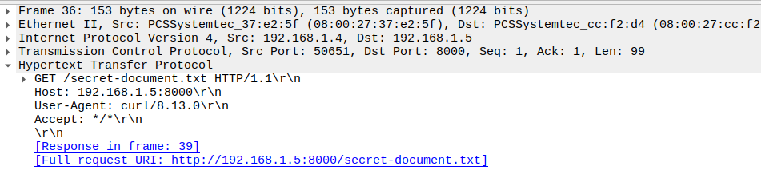
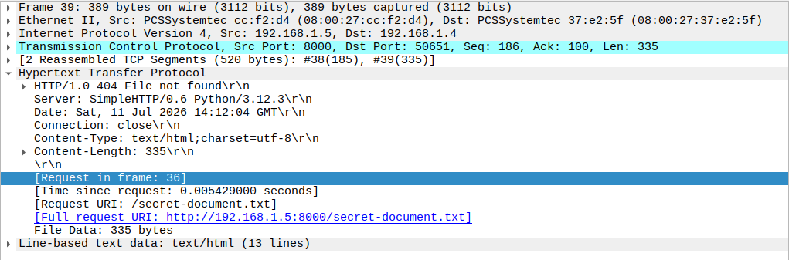
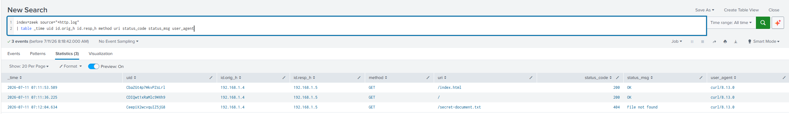
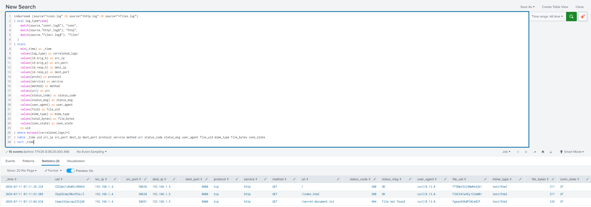

# Network Traffic Investigation Lab

## Overview

This project documents an end-to-end network traffic investigation using **tcpdump, Wireshark, Zeek, and Splunk**.

Traffic was generated from a Windows virtual machine and captured on an Ubuntu virtual machine. The packet capture was then:

1. Reviewed at the packet level in Wireshark
2. Processed into structured metadata with Zeek
3. Converted to JSON
4. Ingested into Splunk
5. Correlated across `conn.log`, `http.log`, and `files.log`

The goal was to demonstrate how raw packet data can be transformed into searchable network evidence and used to reconstruct an HTTP transaction across multiple log sources.

---

## Lab Environment

| System | Role | IP Address |
|---|---|---|
| Windows VM | Traffic source and Splunk server | `192.168.1.4` |
| Ubuntu VM | Web server, packet capture sensor, and Zeek analysis system | `192.168.1.5` |

Both virtual machines were connected to the same VirtualBox NAT Network named `TCM`.

### Software and Tools

- Ubuntu 24.04.2 LTS
- Windows virtual machine
- Zeek 8.0.9
- Wireshark
- tcpdump
- Splunk Enterprise
- Python HTTP server
- Windows PowerShell
- curl

---

## Investigation Workflow

```text
Windows client activity
        ↓
tcpdump packet capture
        ↓
Wireshark packet inspection
        ↓
Zeek metadata generation
        ↓
JSON log conversion
        ↓
Splunk ingestion and correlation
```

---

# Scenario 1: HTTP Traffic Investigation

## Objective

The objective of this scenario was to:

- Generate controlled HTTP traffic between two virtual machines
- Capture the traffic in a PCAP file
- Inspect the packets in Wireshark
- Process the PCAP with Zeek
- Ingest Zeek logs into Splunk
- Correlate connection, HTTP, and file metadata using Zeek UIDs

A request for a nonexistent file was intentionally generated to produce an HTTP `404 File not found` response.

---

## Traffic Generation

A Python HTTP server was started on the Ubuntu VM:

```bash
python3 -m http.server 8000 --bind 192.168.1.5
```

The Windows VM generated ICMP and HTTP traffic:

```powershell
ping 192.168.1.5

curl.exe http://192.168.1.5:8000/

curl.exe http://192.168.1.5:8000/index.html `
-o "$env:USERPROFILE\Downloads\project2-index.html"

curl.exe http://192.168.1.5:8000/secret-document.txt
```

The requests produced:

| Request | Result |
|---|---|
| `/` | `200 OK` |
| `/index.html` | `200 OK` |
| `/secret-document.txt` | `404 File not found` |

---

## Packet Capture with tcpdump

Traffic involving the Windows host was captured from the Ubuntu interface `enp0s3`:

```bash
sudo tcpdump -i enp0s3 -nn host 192.168.1.4 \
-w scenario-1-http.pcap
```

The capture completed with:

- 42 packets captured
- 42 packets received by the filter
- 0 packets dropped by the kernel
- PCAP size of approximately 4.8 KB



---

## Zeek Analysis

The PCAP was processed with Zeek:

```bash
/opt/zeek/bin/zeek -C -r scenario-1-http.pcap
```

The `-C` option was used because the VirtualBox capture contained checksum-offloading artifacts. Without this option, Zeek treated some TCP checksums as invalid and discarded those packets during offline analysis.

Zeek generated the following logs:

```text
conn.log
http.log
files.log
packet_filter.log
```

### HTTP Log Review

The `http.log` records were reviewed with `zeek-cut`:

```bash
/opt/zeek/bin/zeek-cut -d \
ts uid id.orig_h id.resp_h method host uri status_code status_msg user_agent \
< http.log
```

The resulting events showed:

| Source | Destination | Method | URI | Status | User Agent |
|---|---|---|---|---|---|
| `192.168.1.4` | `192.168.1.5:8000` | GET | `/` | `200 OK` | `curl/8.13.0` |
| `192.168.1.4` | `192.168.1.5:8000` | GET | `/index.html` | `200 OK` | `curl/8.13.0` |
| `192.168.1.4` | `192.168.1.5:8000` | GET | `/secret-document.txt` | `404 File not found` | `curl/8.13.0` |



---

## Wireshark Investigation

Wireshark was used to validate the packet-level details recorded by Zeek.

### HTTP Request

The request packet showed:

- Frame: `36`
- Source: `192.168.1.4`
- Destination: `192.168.1.5`
- Destination port: `8000`
- Method: `GET`
- URI: `/secret-document.txt`
- Host: `192.168.1.5:8000`
- User agent: `curl/8.13.0`
- Response linked to frame `39`



### HTTP Response

The corresponding response packet showed:

- Frame: `39`
- Source: `192.168.1.5`
- Destination: `192.168.1.4`
- Status: `HTTP/1.0 404 File not found`
- Server: `SimpleHTTP/0.6 Python/3.12.3`
- Content type: `text/html`
- Content length: `335`
- Request URI: `/secret-document.txt`
- Request linked to frame `36`



---

## Preparing Zeek Logs for Splunk

The PCAP was processed a second time with JSON output enabled:

```bash
/opt/zeek/bin/zeek -C -r scenario-1-http.pcap \
LogAscii::use_json=T
```

The following JSON logs were transferred to the Windows VM:

```text
conn.log
http.log
files.log
```

A dedicated Splunk index named `zeek` was created.

### Splunk Source Types

The logs used the following source types:

```text
zeek:http:json
zeek:conn:json
zeek:files:json
```

Timestamp parsing used the Zeek `ts` field:

```text
Timestamp format: %s.%6N
Timestamp field: ts
Time zone: GMT
```

The metadata host value was set to:

```text
ubuntu-zeek-sensor
```

---

## Splunk HTTP Event Search

The HTTP events were reviewed with the following SPL query:

```spl
index=zeek source="*http.log"
| table _time uid id.orig_h id.resp_h method uri status_code status_msg user_agent
```

The results confirmed:

- Three HTTP GET requests
- Two successful `200 OK` responses
- One `404 File not found` response
- Windows as the originating client
- Ubuntu as the responding web server



---

## Three-Log Correlation

Zeek assigns a shared `uid` to related network activity. This identifier was used to correlate records across:

- `conn.log`
- `http.log`
- `files.log`

The following SPL query combined connection metadata, HTTP details, and transferred file metadata:

```spl
index=zeek (source="*conn.log" OR source="*http.log" OR source="*files.log")
| eval log_type=case(
    match(source,"conn\.log$"), "conn",
    match(source,"http\.log$"), "http",
    match(source,"files\.log$"), "files"
  )
| stats
    min(_time) as _time
    values(log_type) as correlated_logs
    values(id.orig_h) as src_ip
    values(id.orig_p) as src_port
    values(id.resp_h) as dest_ip
    values(id.resp_p) as dest_port
    values(proto) as protocol
    values(service) as service
    values(method) as method
    values(uri) as uri
    values(status_code) as status_code
    values(status_msg) as status_msg
    values(user_agent) as user_agent
    values(fuid) as file_uid
    values(mime_type) as mime_type
    values(total_bytes) as file_bytes
    values(conn_state) as conn_state
    by uid
| where mvcount(correlated_logs)=3
| table _time uid src_ip src_port dest_ip dest_port protocol service method uri status_code status_msg user_agent file_uid mime_type file_bytes conn_state
| sort _time
```

The search processed ten total events:

- Four connection events
- Three HTTP events
- Three file events

The ICMP connection was excluded from the final table because it did not have matching HTTP or file records.

The query returned three complete HTTP transactions:

```text
TCP connection
      ↓
HTTP request and response
      ↓
Transferred HTML object
```



---

## Investigation Findings

The investigation established the following sequence:

1. The Windows VM initiated traffic to the Ubuntu VM.
2. Three TCP connections were established to port `8000`.
3. Three HTTP GET requests were made.
4. The requests for `/` and `/index.html` returned `200 OK`.
5. The request for `/secret-document.txt` returned `404 File not found`.
6. Zeek recorded each TCP connection in `conn.log`.
7. Zeek recorded each HTTP transaction in `http.log`.
8. Zeek recorded the returned HTML objects in `files.log`.
9. Splunk correlated all three log types using the shared Zeek `uid`.
10. Wireshark confirmed the exact request and response packets.

### Notable Transaction

```text
Source:          192.168.1.4
Destination:     192.168.1.5:8000
Method:          GET
URI:             /secret-document.txt
Status:          404 File not found
User agent:      curl/8.13.0
Response type:   text/html
Response size:   335 bytes
Connection state: SF
```

The `SF` connection state indicates that Zeek observed a normally established and terminated TCP connection.

A single HTTP 404 response is not inherently malicious. In this scenario, it was intentionally generated to demonstrate packet inspection, structured metadata analysis, and cross-log correlation.

---

## Key Takeaways

- tcpdump provides a lightweight method for collecting network traffic.
- Wireshark is useful for validating exact packet-level details.
- Zeek converts raw packets into structured and searchable metadata.
- Zeek UIDs make it possible to correlate related events across multiple log types.
- Splunk can combine connection, application, and file metadata into a single investigation timeline.
- File metadata direction may differ from request direction because the server transmits the HTTP response object back to the client.
- A detection should be based on meaningful patterns rather than treating one isolated 404 response as malicious.

---

## Future Improvements

Future additions to this project may include:

- Repeated HTTP 404 requests
- Web path enumeration detection
- Port scanning analysis
- Suspicious DNS activity
- File download investigation
- Splunk dashboards
- Scheduled Splunk alerts
- Additional Zeek log sources
- Automated ingestion of Zeek JSON logs

---

## Project Status

**Scenario 1: Complete**

The current scenario demonstrates:

- Controlled traffic generation
- Packet capture
- Packet-level validation
- Zeek log generation
- JSON ingestion into Splunk
- HTTP event analysis
- Three-log correlation
